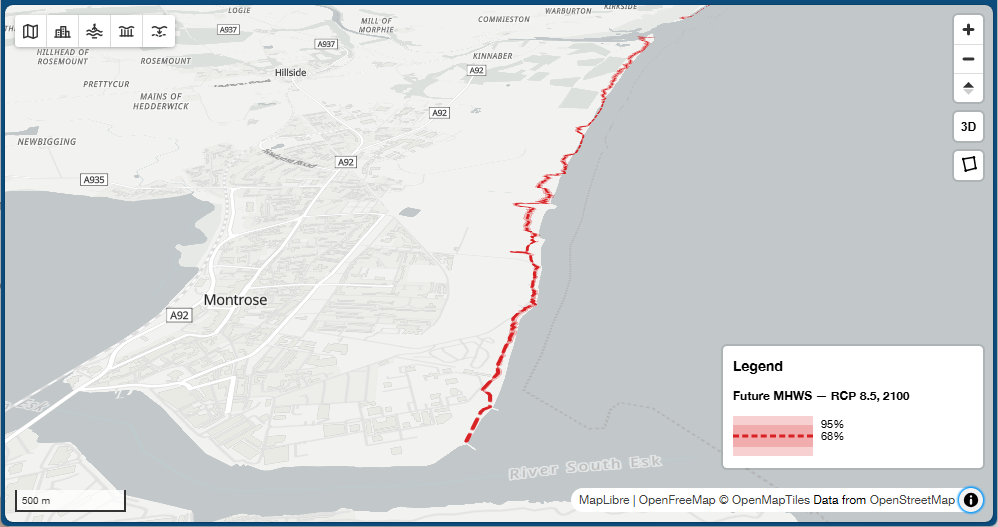

# Coastal Mapping Viewer

An interactive web-based viewer for exploring observed and projected coastal change.

The **Coastal Mapping Viewer** brings together historical shoreline observations, rates of coastal change, future shoreline projections, uncertainty estimates, environmental datasets and mapped assets in a single interactive interface. It is being developed as a lightweight, open-source tool for exploring and communicating coastal change.

The current viewer uses **Montrose Bay, Scotland**, as a demonstration area.


***Example view from the Coastal Mapping Viewer showing anticipated future coastal change at Montrose***

## Live viewer

The Coastal Mapping Viewer is available online through GitHub Pages.

- [Current development version](https://mdhurst1.github.io/CoastalMappingViewer/)
- [Version 0.1.0](https://mdhurst1.github.io/CoastalMappingViewer/v0.1.0/)

Version 0.1 represents the first public release of the viewer and provides a fixed reference version of the Montrose Bay demonstrator. The development version may change as new functionality, datasets and interface improvements are added.

## Features

### Explore past coastal change

Historical shoreline positions can be displayed using different coastal indicators, including:

* Mean High Water Springs (MHWS)
* Vegetation edge

Shorelines are coloured by survey date, allowing the historical evolution of the coast to be explored visually.

### Examine rates of shoreline change

Coastal transects summarise changes in shoreline position through time.

Selecting a transect opens an interactive time-series plot showing the available shoreline observations and calculated rates of change. Transects are coloured according to the direction and magnitude of shoreline change, making areas of erosion and accretion easy to identify.

### Explore future shorelines

Projected future shoreline positions can be explored for different climate scenarios and years.

The viewer currently supports:

* RCP 2.6
* RCP 4.5
* RCP 8.5
* projections from 2030 to 2100

Future shoreline positions are displayed alongside uncertainty envelopes to communicate the range of possible future coastal positions rather than presenting a single deterministic shoreline.

### View coastal and marine information

Additional contextual datasets can be switched on and off, including tide gauges and other information relevant to understanding coastal change.

### Explore assets

Mapped assets can be displayed alongside coastal change information, including:

* buildings
* roads
* railways

This allows potential interactions between coastal change and the built environment to be explored directly on the map.

### Interactive mapping

The viewer also provides:

* multiple basemaps, including satellite imagery
* 2D and 3D perspective views
* interactive feature popups
* map legends
* polygon drawing and selection tools
* standard navigation and scale controls

## Demonstration area

The current implementation focuses on **Montrose Bay on the east coast of Scotland**.

Montrose provides a useful demonstration of the viewer because of its extensive historical shoreline record and ongoing coastal change. The intention is for the underlying viewer architecture to support additional coastal areas and datasets in future.

## Data

The viewer combines several types of coastal information, including:

* historical shoreline positions
* vegetation-edge positions
* shoreline-change transects and rates
* future shoreline projections
* future shoreline uncertainty
* tide-gauge information
* buildings, roads and railway infrastructure

The demonstration datasets are currently stored as GeoJSON and loaded directly by the browser.

The datasets included in this repository are primarily intended to demonstrate the functionality of the viewer. Data provenance, licensing and appropriate attribution should be checked before reuse.

## Technology

The Coastal Mapping Viewer is a client-side web application built using:

* [MapLibre GL JS](https://maplibre.org/) for interactive web mapping
* [Plotly.js](https://plotly.com/javascript/) for interactive shoreline time-series plots
* [Terra Draw](https://github.com/JamesLMilner/terra-draw) for map drawing tools
* [Vite](https://vite.dev/) for development and production builds

The application is written in JavaScript, HTML and CSS and does not currently require a server-side backend.

## Running locally

Clone the repository and install the required packages:

```bash
npm install
```

Start the Vite development server:

```bash
npm run dev
```

Vite will report the local address of the viewer, normally:

```text
http://localhost:5173/
```

To create a production build:

```bash
npm run build
```

The built application will be written to the `dist` directory.

## Project structure

The application is organised into separate modules for configuration, application state, map controls, map layers, interactions and popup content.

```text
src/
├── config/       Dataset, basemap, layer and legend configuration
├── controls/     Map controls and user-interface components
├── layers/       Dataset-specific map layers
├── map/          Shared map and layer utilities
├── popups/       Popup content and interactive plots
├── state/        Application and map state management
├── styles/       Component-specific styling
└── main.js       Application initialisation
```

Static datasets and other resources used by the viewer are stored under `public/`.

## Releases

### Version 0.1

Version 0.1 is the first public release of the Coastal Mapping Viewer and establishes the core functionality of the Montrose Bay demonstrator.

The release includes:

* interactive display of historical MHWS and vegetation-edge shorelines
* transect-based shoreline-change rates
* interactive shoreline time-series plots
* future shoreline projections under multiple RCP scenarios
* future shoreline uncertainty envelopes
* tide-gauge information
* buildings, roads and railway infrastructure
* multiple basemaps
* 2D and 3D map views
* polygon drawing and selection tools

A static deployment of v0.1 is retained so that the functionality associated with this release remains accessible as development continues.

See the [GitHub Releases](GITHUB_RELEASES_URL) page for release history and source-code snapshots.

## Development status

The Coastal Mapping Viewer is under active development.

**Version 0.1** provides the first stable demonstration of the core viewer functionality for Montrose Bay, bringing together observed shoreline change, calculated change rates, future shoreline projections, uncertainty and contextual information within a single web-mapping interface.

Development beyond v0.1 will focus on extending the viewer to additional datasets and coastal areas and improving the way observed and projected coastal change is explored and communicated.

## Author

**Martin Hurst**
University of Glasgow

## Licence

The Coastal Mapping Viewer software is released under the MIT Licence.

Datasets displayed by or distributed with the viewer may be subject to separate licences and attribution requirements. The MIT Licence applies to the software itself and should not be assumed to apply to third-party or derived datasets included in the repository.